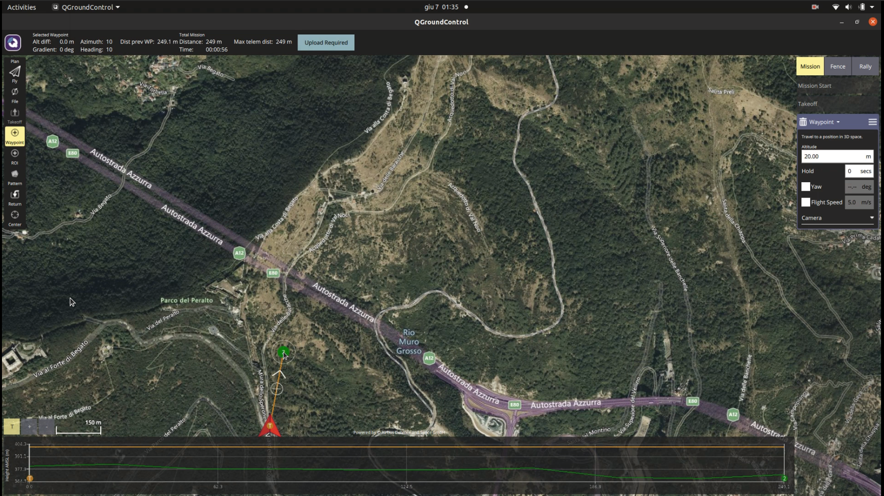
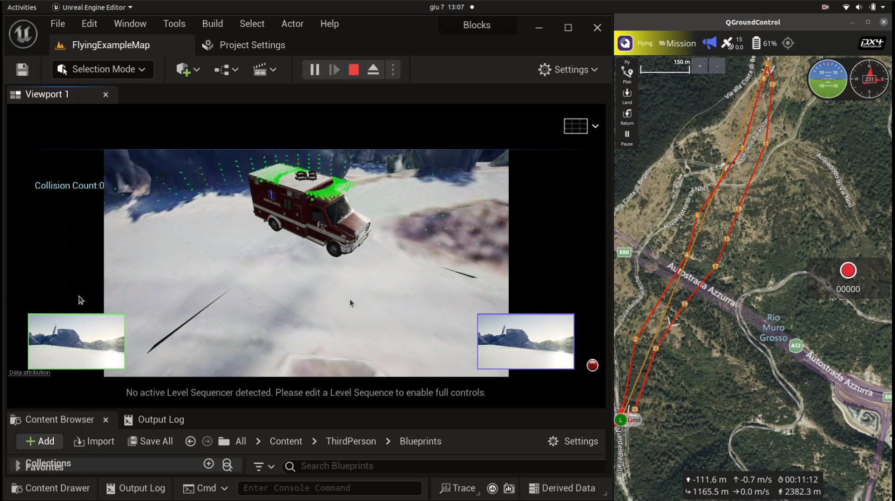
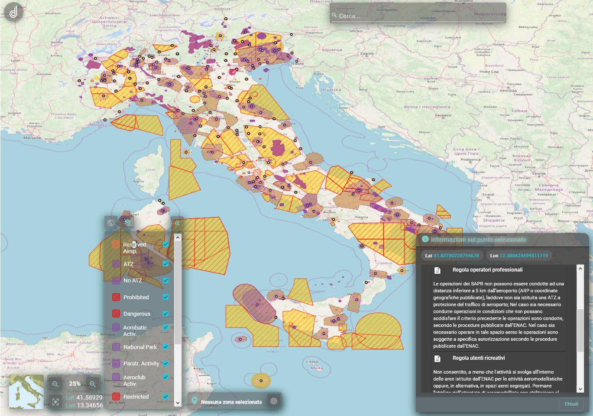
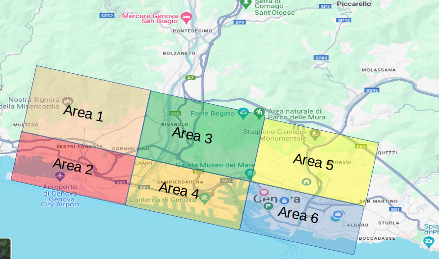

# Drone-Assisted Smart Ambulance Systems for Emergency Response Final Project
This project is developed by:
1. *Ahmet Samet Kosum - s5635830*
2. *Mustafa Melih Toslak - s5431021*
3. *Natnael Berhanu Takele - s5446838*

## Note: 
- This project developed and tested computer with RTX 2060 graphic card 
- On ubuntu 20.04
- ROS Noetic
- With few more changes it is possible to run it on ubuntu 22.04. 

## Aim of The Project
This project aims to simulate an emergency medical response scenario in the challenging terrain of Righi,
located in Genoa, Italy. The scenario involves a smart ambulance equipped with a drone, designed to deliver
life-saving medicines to a patient in an inaccessible area. The simulation will be developed using Unreal
Engine, Cesium, Airsim, QGroundControl, PX4, and Python APIs, ROS , D-Flight to create a realistic and
interactive environment for testing and validating the system’s capabilities.

## Used Tools for Project
### Unreal Engine 5.2.0
Unreal Engine 5 is utilized for creating a detailed and realistic simulation environment. This game engine
provides high-fidelity graphics, advanced physics simulation, and extensive support for virtual reality (VR) and
mixed reality (MR) applications.

### Airsim(Colosseum)
Airsim, developed by Microsoft, is an open-source simulator for drones and ground vehicles. It is used to
simulate the physical and sensor dynamics of the drone for the project. Colosseum is forked from Airsim, a
simulator for robotic, autonomous systems, built on Unreal Engine5+.

### Cesium v2.5 with Google Maps API
The accurate representation of the Genova map within the simulation is achieved using Google API and Ce-
sium. Google API provides real-time data and mapping services, while Cesium offers detailed 3D geospatial
visualization.

### MAVLink
MAVLink, short for Micro Air Vehicle Link, is a lightweight communication protocol designed for exchanging
information between unmanned aerial vehicles (UAVs) and ground control stations (GCS), as well as other
components like onboard computers.

### PX4 and QGroundControl
The PX4 open-source flight control software is employed for managing the drone’s flight operations. It provides
advanced flight modes and robust control algorithms. QGroundControl acts as the ground control station
software, offering a user-friendly interface for mission planning, real-time monitoring, and manual control of the
drone. This setup ensures precise and reliable drone operations in the simulated environment.

### D-Flight
D-Flight is a platform that provides essential data and services for drone operations within regulated airspaces.
It ensures compliance with aviation regulations by offering flight plan validation, real-time airspace information,
and no-fly zone enforcement.

### Spline
The ambulance navigation within the simulation is managed using Spline technology, which allows for smooth
and accurate path following along predefined routes. This ensures that the ambulance can effectively navigate
through the drivable parts of the terrain before deploying the drone for the final leg of the journey.


## Installation of The Tools on Ubuntu 20.04

### Unreal Engine 5.2.0 installation

- Follow the 6 steps provided **Accessing Unreal Engine Source Code on GitHub** [Unreal Engine 5.2.0](https://dev.epicgames.com/documentation/en-us/unreal-engine/downloading-unreal-engine-source-code)

- Clone the UE5.2 if your internet connection is not good please install the zip file of UE5.2
```sh 
mkdir VR
cd VR
git clone https://github.com/EpicGames/UnrealEngine.git
git checkout 5.2
```
- We need to make some changes before installation
```sh 
cd UnrealEngine-5.2.0-release/Engine/Source/Developer/DesktopPlatform/Private
gedit DesktopPlatformBase
```
- go to line 581 and change it with
```cpp
Arguments += " -Progress";
```
- You may skip this step. To speed up the next commands you may increase the processor cores to do that first check your number of processor cores, keep a few of them, and use the rest ( in our case it is 12 )
```sh 
nproc
make j10
```
- Navigate the UnrealEngine-5.2.0-release folder and run the following commands.
```sh 
./Setup.sh
./GenerateProjectFiles.sh
make
```
If you have an error while running `./Setup.sh` run it with `sudo`

- Now you should be able to run UE5.2
```sh
cd UnrealEngine-5.2.0-release/Engine/Binaries/Linux
./UnrealEditor
```

### Colesseum installation
- Clone the Colesseum repository
```sh
cd VR
git clone https://github.com/CodexLabsLLC/Colosseum.git
```
- We need to make some changes before installation, first open the setup.sh and change line 63 with:
```sh
sudo apt-get install -y clang-10 clang++-10 libc++-10-dev libc++abi-10-dev
```
- Open the build.sh file and change lines 67,68,70,71 respectively with the following:
```sh
export CC="gcc-10"
export CXX="g++-10"
export CC="clang-10"
export CXX="clang++-10"
```
- After going to Colosseum/cmake/cmake-modules then open CommonSetup.cmake and change the lines 62 and 64 respectively with the following:

```sh
set(CXX_EXP_LIB "-L${LLVM_LIBRARY_DIRS} -ferror-limit=10")
set(CXX_EXP_LIB "-fmax-errors=10 -Wnoexcept -Wstrict-null-sentinel")
```
- Go to Colosseum/ros2/src/airsim_ros_pkgs then open CMakeLists.txt and change line 37 with:
```sh
-fmax-errors=10
```

- Now we can build it
```sh
./setup.sh
./build.sh
```
If you have an error related with clang version you can try 8 or 12 instead of 10


## PX4 installation
- Clone the PX4 repository
```sh
cd VR
git clone --recursive --branch release/1.14 https://github.com/PX4/PX4-Autopilot.git
```
- Then install the dependencies with the following commands:
```sh
cd PX4-Autopilot/Tools/setup
./ubuntu.sh
```
- restart your computer and run the following command:
```sh
make px4_sitl none_iris
```
if you have an error run `python3 -m pip install empy==3.3.4` this command and repeat the previous step.

### QGroundControl Installation

- Before installing QGroundControl for the first time, run these commands:
```sh
sudo usermod -a -G dialout $USER
sudo apt-get remove modemmanager -y
sudo apt install gstreamer1.0-plugins-bad gstreamer1.0-libav gstreamer1.0-gl -y
sudo apt install libfuse2 -y
sudo apt install libxcb-xinerama0 libxkbcommon-x11-0 libxcb-cursor0 -y
```
- Install the image [QGC](https://d176tv9ibo4jno.cloudfront.net/latest/QGroundControl.AppImage)
- give a permission to the file and run it:
```sh
chmod +x ./QGroundControl.AppImage
./QGroundControl.AppImage
```
### Cesium with Google Maps API Installation
- Go to this link and install the [Cesium v2.5](https://github.com/CesiumGS/cesium-unreal/releases/download/v2.5.0/CesiumForUnreal-52-v2.5.0.zip) 

### MAVLink, D-Flight, and Spline Installation.
- MAVlink will be automatically installed during the PX4 installation
- D-Flight there is no installation of the D-flight for our project we will just open the D-Flight App and take the necessary information manually.
- Spline is a Unreal Engine tool

## Integrations of The Tools

### Unreal Engine 5.2.0, Cesium with Google Maps API and Colesseum
- It is better to use Blocks environment created by Colesseum (Colesseum will be already integrated)
- Run the Unreal Engine and open the Colosseum/Unreal/Environments/Blocks/Blocks.uproject in Unreal Engine.
- Delete everything in the project except PlayerStart and close it.
- Go to CesiumForUnreal-52-v2.5.0 folder and copy the CesiumForUnreal folder
- Paste it to the Colosseum/Unreal/Environments/Blocks/Plugins, also you should see the Airsim plugin.
- Run the Unreal Engine and open the Colosseum/Unreal/Environments/Blocks/Blocks.uproject in Unreal Engine.
- Please follow the [tutorials](https://cesium.com/learn/unreal/unreal-quickstart/) provided from cesium and watch this [youtube tutorial](https://www.youtube.com/watch?v=TbHCvAo-aGg) to oppen a Google Maps account and connect it.
- For the GeoReference Origin please use the following for now:
```sh
Latitude: 44.4364209
Longitude: 8.9320742
```
<p float="left">
  
   
</p>

### Colesseum, PX4 and QGrounControl
- Navigate to your Documents/Airsim folder and open the settings.json file.
- Change this file with provided [settings.json](./settings.json) file in this repository.
- The changes in this file allow us to connect Colesseum, PX4, and QGControl via MAVlink.
- Also settings.json file has the necessary sensors for drone, we will use them to create navigation algorithms.

<p float="left">
  
   
</p>

### ROS, D-Flight and Colesseum
- To mimic the D-Flight app we created the simple Ros node [d-flight.py](./d-flight.py)
- Copy this node and place it in Colosseum/ros/src/airsim_tutorial_pkgs/scripts folder
- Then navigate to ros folder and build it:
```sh
catkin build; # or catkin_make
source devel/setup.bash
```
- If we launch and run the following commands, this will integrate ROS, D-Flight, and Colesseum:
```sh
roslaunch airsim_ros_pkgs airsim_node.launch
rosrun airsim_tutorial_pkgs d-flight.py
```
To visualize the sensors you may wanna run rviz

<p float="left">
  
   
</p>

## How to Use Bug2 Algorithm to Avoid Obstacles
The UAV, or drone, is controlled using a combination of PX4 flight control software and QGroundControl. This enables operators to efficiently plan and manage drone missions. However, QGroundControl lacks obstacle avoidance functionality. To address this limitation, we combined QGroundControl with [Bug2](./bug2.py) algorithm to handle such situations. To detect objects in the environment, we employed four different distance sensors positioned at 0 degrees, 90 degrees, 180 degrees, and 360 degrees. We used a preferred direction to compute the Bug2 algorithm, which is implemented by selecting the optimal direction that avoids collisions within the preferred path. This sensor can be found in the settings.json file.

- To run this file before command these:
```sh
pip install msgpack-rpc-python
pip install airsim
```
- Then to run it:
```sh
chmod +x bug2.py
python //or pyhon3 bug2.py
```
## How to Run the Full Project

- Run the Unreal Engine 5.2.0
```sh
cd UnrealEngine-5.2.0-release/Engine/Binaries/Linux
./UnrealEditor
```
- Open the Colosseum/Unreal/Environments/Blocks/Blocks.uproject
- Run PX4
```sh
cd PX4-Autopilot/Tools/setup
make px4_sitl none_iris
```
- Run QGroundControl
```sh
./QGroundControl.AppImage
```
- Create a Mission in the QGroundControl app
- Run the simulation and you need to wait a little bit
- Run bug2 algorithm
```sh
python //or pyhon3 bug2.py
```
- Run D-flight node to mimic D-fligh app and run rviz to visualize the sensors
```sh
roslaunch airsim_ros_pkgs airsim_node.launch
rosrun airsim_tutorial_pkgs d-flight.py
rviz
```
- Open the QGroundControl again, upload the plan file to the drone, and start the mission.

- WELL DONE!!
- You can watch the video of our project below.
[](https://www.youtube.com/watch?v=VRSgiM8ewTc)


 


